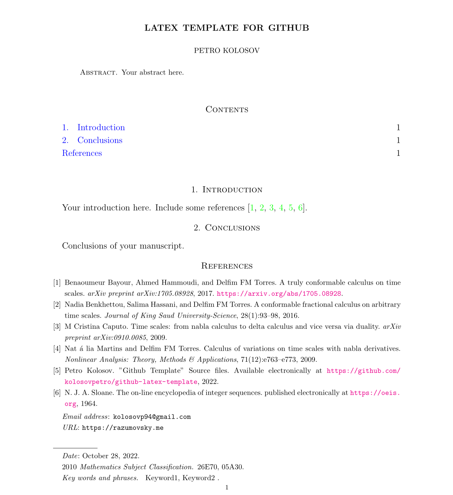
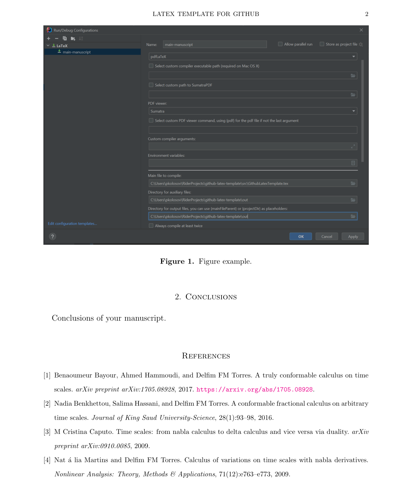

# GitHub LaTeX Template

LaTeX template for GitHub including general CI/CD actions and Mathematica templates.

## Build and run in Intellij IDEA

- Install `MikTeX`: https://miktex.org/download
- Update `MikTeX`
- Install `SumatraPDF` viewer: https://www.sumatrapdfreader.org/download-free-pdf-viewer
- Install `Intellij IDEA Ultimate`: https://www.jetbrains.com/idea/download/#section=windows
- Activate `Intellij IDEA Ultimate`
- Install `TeXiFy IDEA` plugin: https://plugins.jetbrains.com/plugin/9473-texify-idea
- Clone this repository locally: `https://github.com/kolosovpetro/github-latex-template.git`
- Open `github-latex-template` folder in `Intellij IDEA Ultimate` and configure as follows
    - LaTeX Configuration
      
    - BibTeX Configuration
      
- Configure Inverse Search in `Intellij IDEA` for SumatraPDF: `Tools -> LaTeX -> Configure Inverse Search`
- Compile document using `Shift + F10`

## How to use Mathematica package

- Open the package file `GithubLatexTemplateMathematicaPackage.m` in Wolfram Mathematica, I use version 13.0
- Execute the package using `Shift+Enter`
- Open the notebook file `GithubLatexTemplateMathematicaNotebook.nb`
- Execute the line: `Needs["GithubLatexTemplateMathematicaPackage"]`
- Continue your work as desired

## Configure CI / CD

Set repository secrets

- `GH_ACCESS_TOKEN`: Generate GitHub Personal access token at
  `Settings -> Developer Settings -> Personal access tokens -> Generate mew token`

## Actions and their trigger policy

- `build-pdf.yml` builds project using `TeXLive`. Triggered on `pull_request`, `push` to `develop` branch
- `build-and-deploy-pdf.yml` builds project using `TeXLive` and deploys to `GitHub Pages`. Triggered on `push` to `main`
  branch

## Template example

Compiled document looks like as follows

  
  

## License

This work is licensed under [Attribution-NonCommercial-ShareAlike 4.0 International](https://creativecommons.org/licenses/by-nc-sa/4.0/legalcode) license
